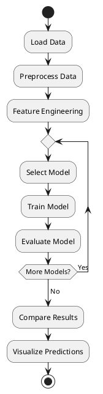
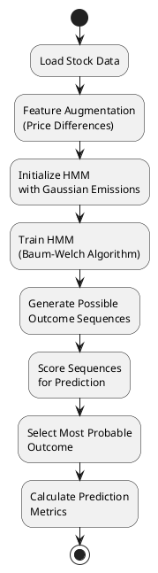
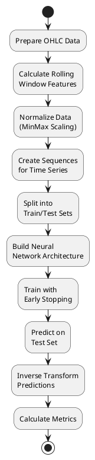
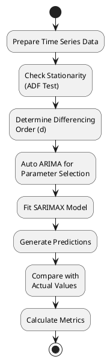

# Stock Price Prediction System Analysis

## Overview of the System

This system provides a comprehensive framework for stock price prediction using multiple machine learning and statistical models. It includes data loading, preprocessing, feature engineering, and six different prediction models (HMM, XGBoost, LSTM, BiLSTM, GRU, and ARIMA) with evaluation metrics.

## System Workflow

1. **Data Loading & Preprocessing**
2. **Feature Engineering**
3. **Model Training & Evaluation**
4. **Result Visualization & Comparison**

## Preprocessing Functionality and Reasoning

### Data Loading (`load_data()`)
- **Purpose**: Loads stock data from CSV and performs initial cleaning
- **Key Operations**:
  - Date parsing with error handling
  - Numeric conversion with NaN handling
  - Validation of required columns
  - Sorting by company and date
- **Reasoning**: Ensures data consistency and handles common data issues before feature engineering

### Feature Engineering (`calculate_features()`)
- **Purpose**: Creates technical indicators and statistical features
- **Key Features**:
  - Basic price features (High-Low diff, Open-Close diff)
  - Moving averages (7D MA, 5-day SMA, 3-day EMA)
  - Technical indicators (MACD, RSI, Bollinger Bands)
  - Lagged features (previous day's close, volume)
  - Date features (day of week, month, quarter)
- **Reasoning**: Provides models with meaningful patterns and relationships in the data

## Mathematical Foundations of Each Model

### 1. Hidden Markov Model (HMM)

**Equation**:
```
P(X|λ) = ∑_q P(X|q,λ)P(q|λ)
```
where:
- λ = model parameters
- q = hidden state sequence
- X = observed sequence

**Key Components**:
- Gaussian emission probabilities
- Baum-Welch algorithm for training
- Viterbi algorithm for decoding

### 2. XGBoost

**Objective Function**:
```
L(ϕ) = ∑_i l(y_i, ŷ_i) + ∑_k Ω(f_k)
```
where:
- l = differentiable loss function
- Ω = regularization term
- f_k = tree structure

**Tree Boosting**:
```
ŷ_i^(t) = ŷ_i^(t-1) + f_t(x_i)
```

### 3. LSTM

**Gate Equations**:
```
Forget gate: f_t = σ(W_f·[h_{t-1}, x_t] + b_f)
Input gate: i_t = σ(W_i·[h_{t-1}, x_t] + b_i)
Output gate: o_t = σ(W_o·[h_{t-1}, x_t] + b_o)
Cell state: C̃_t = tanh(W_C·[h_{t-1}, x_t] + b_C)
```

### 4. BiLSTM

**Combines forward and backward LSTM**:
```
h_t = [h_t^→; h_t^←]
```

### 5. GRU

**Simplified Gates**:
```
Update gate: z_t = σ(W_z·[h_{t-1}, x_t])
Reset gate: r_t = σ(W_r·[h_{t-1}, x_t])
New memory: h̃_t = tanh(W·[r_t ⊙ h_{t-1}, x_t])
Final memory: h_t = (1-z_t) ⊙ h_{t-1} + z_t ⊙ h̃_t
```

### 6. ARIMA

**ARIMA(p,d,q) Model**:
```
(1 - ∑_{i=1}^p ϕ_i L^i)(1 - L)^d X_t = (1 + ∑_{i=1}^q θ_i L^i)ε_t
```
where:
- L = lag operator
- d = differencing order
- ϕ = AR parameters
- θ = MA parameters

## Work Methodology Diagrams (PlantUML)

### Overall System Flow



### HMM Methodology



### XGBoost Methodology

```plantuml
@startuml
skinparam monochrome true

start
:Prepare Features\n(Technical Indicators);
:Split Data\n(Train/Test);
:Initialize XGBoost\nRegressor;
:Walk-Forward\nValidation;
:Train Model\non Window;
:Predict Next Step;
:Update Training\nWindow;
repeat while (More Test Data?)
:Calculate Final\nMetrics;
stop
@enduml
```

### LSTM/BiLSTM/GRU Methodology



### ARIMA Methodology



## Key Implementation Details

1. **Modular Design**: Each model is implemented as a separate function with consistent input/output
2. **Evaluation Metrics**: Standard metrics (MAE, MSE, RMSE, R²) for model comparison
3. **Visualization**: Consistent plotting for actual vs predicted values
4. **Walk-Forward Validation**: Used in XGBoost for realistic time-series evaluation
5. **Early Stopping**: Implemented in neural networks to prevent overfitting

The system provides a comprehensive framework for comparing different approaches to stock price prediction, with each model offering unique strengths for different market conditions and data patterns.
