# **Comprehensive Stock Price Prediction System: Professional Explanation**

## **1. System Overview**
The **Stock Price Prediction System** is a **multi-model machine learning framework** designed to forecast stock prices using **historical market data**. It integrates **six distinct predictive models**:
1. **Hidden Markov Model (HMM)** – A probabilistic model for regime detection.
2. **XGBoost** – A gradient-boosted decision tree model for non-linear regression.
3. **LSTM (Long Short-Term Memory)** – A deep learning model for sequential data.
4. **BiLSTM (Bidirectional LSTM)** – An enhanced LSTM that processes data in both forward and backward directions.
5. **GRU (Gated Recurrent Unit)** – A simplified RNN variant with gating mechanisms.
6. **ARIMA (AutoRegressive Integrated Moving Average)** – A classical time-series forecasting model.

### **Key Features**
- **End-to-End Pipeline**: From data loading to prediction and evaluation.
- **Feature Engineering**: Technical indicators (RSI, MACD, Bollinger Bands) and statistical features.
- **Model Comparison**: Evaluates performance using **MAE, MSE, RMSE, and R²**.
- **Visualization**: Generates **comparative prediction plots** for each model.

---

## **2. Data Preprocessing & Feature Engineering**
### **A. Data Loading (`load_data()`)**
- **Input**: CSV file containing stock data (Open, High, Low, Close, Volume).
- **Processing Steps**:
  1. **Parses dates** with error handling (`pd.to_datetime`).
  2. **Converts numeric columns** (handles missing/invalid values).
  3. **Drops NaN values** to ensure clean data.
  4. **Sorts by Company & Date** for chronological consistency.

### **B. Feature Engineering (`calculate_features()`)**
- **Objective**: Extract meaningful patterns from raw stock data.
- **Key Features Generated**:
  1. **Price-Based Features**:
     - `High_Low_Diff` = `High - Low` (volatility measure).
     - `Open_Close_Diff` = `Close - Open` (daily price movement).
  2. **Moving Averages**:
     - `7D_MA` (7-day moving average).
     - `SMA_5` (5-day simple moving average).
     - `EMA_3` (3-day exponential moving average).
  3. **Technical Indicators**:
     - **MACD** (Moving Average Convergence Divergence):
       \[
       MACD = EMA_{12}(Close) - EMA_{26}(Close)
       \]
     - **RSI (Relative Strength Index)**:
       \[
       RSI = 100 - \left( \frac{100}{1 + RS} \right), \quad \text{where } RS = \frac{AvgGain}{AvgLoss}
       \]
     - **Bollinger Bands**:
       \[
       UpperBand = SMA_{20} + 2 \times \sigma_{20}, \quad LowerBand = SMA_{20} - 2 \times \sigma_{20}
       \]
  4. **Lagged Features**:
     - `Lag_1_Close` (previous day’s closing price).
     - `volume_lag_1` (previous day’s trading volume).
  5. **Time-Based Features**:
     - `dayofweek`, `month`, `quarter`, `year` (captures seasonality).

---

## **3. Model Architectures & Mathematical Foundations**
### **A. Hidden Markov Model (HMM)**
- **Concept**: Models stock prices as a sequence of hidden states (e.g., "bullish," "bearish").
- **Key Equations**:
  1. **State Transition Probability**:
     \[
     A = [a_{ij}], \quad a_{ij} = P(q_t = j | q_{t-1} = i)
     \]
  2. **Emission Probability** (Gaussian):
     \[
     b_j(x) = \mathcal{N}(x | \mu_j, \sigma_j)
     \]
  3. **Forward-Backward Algorithm** (for inference):
     \[
     \alpha_t(j) = b_j(x_t) \sum_{i} \alpha_{t-1}(i) a_{ij}
     \]
  4. **Viterbi Algorithm** (for most likely path):
     \[
     \delta_t(j) = \max_i \delta_{t-1}(i) a_{ij} b_j(x_t)
     \]
- **Prediction Workflow**:
  1. Train HMM using **Baum-Welch (EM Algorithm)**.
  2. Generate possible future sequences.
  3. Select the most probable outcome using **Viterbi decoding**.

### **B. XGBoost (Extreme Gradient Boosting)**
- **Concept**: Ensemble of decision trees with gradient boosting.
- **Objective Function**:
  \[
  \mathcal{L}(\theta) = \sum_{i} l(y_i, \hat{y}_i) + \sum_{k} \Omega(f_k)
  \]
  where:
  - \( l \) = loss function (e.g., MSE).
  - \( \Omega(f_k) \) = regularization term.
- **Tree Construction**:
  - Uses **Newton-Raphson approximation** for optimization.
  - Splits nodes based on **information gain**:
    \[
    Gain = \frac{1}{2} \left[ \frac{(\sum_{i \in I_L} g_i)^2}{\sum_{i \in I_L} h_i + \lambda} + \frac{(\sum_{i \in I_R} g_i)^2}{\sum_{i \in I_R} h_i + \lambda} - \frac{(\sum_{i \in I} g_i)^2}{\sum_{i \in I} h_i + \lambda} \right]
    \]
- **Walk-Forward Validation**:
  - Trains on a rolling window to simulate real-time forecasting.

### **C. LSTM (Long Short-Term Memory)**
- **Concept**: Deep learning model for sequential data with memory cells.
- **Key Equations**:
  1. **Forget Gate**:
     \[
     f_t = \sigma(W_f \cdot [h_{t-1}, x_t] + b_f)
     \]
  2. **Input Gate**:
     \[
     i_t = \sigma(W_i \cdot [h_{t-1}, x_t] + b_i)
     \]
  3. **Candidate Memory**:
     \[
     \tilde{C}_t = \tanh(W_C \cdot [h_{t-1}, x_t] + b_C)
     \]
  4. **Cell State Update**:
     \[
     C_t = f_t \odot C_{t-1} + i_t \odot \tilde{C}_t
     \]
  5. **Output Gate**:
     \[
     o_t = \sigma(W_o \cdot [h_{t-1}, x_t] + b_o)
     \]
     \[
     h_t = o_t \odot \tanh(C_t)
     \]
- **Training**:
  - Uses **Adam optimizer** with **early stopping** to prevent overfitting.

### **D. BiLSTM (Bidirectional LSTM)**
- **Extension of LSTM**:
  - Processes data in **both forward and backward directions**.
  - Final hidden state:
    \[
    h_t = [\overrightarrow{h_t}; \overleftarrow{h_t}]
    \]
  - Captures **past and future context** for better predictions.

### **E. GRU (Gated Recurrent Unit)**
- **Simplified LSTM** with fewer parameters.
- **Key Equations**:
  1. **Update Gate**:
     \[
     z_t = \sigma(W_z \cdot [h_{t-1}, x_t])
     \]
  2. **Reset Gate**:
     \[
     r_t = \sigma(W_r \cdot [h_{t-1}, x_t])
     \]
  3. **New Memory**:
     \[
     \tilde{h}_t = \tanh(W \cdot [r_t \odot h_{t-1}, x_t])
     \]
  4. **Final Memory**:
     \[
     h_t = (1 - z_t) \odot h_{t-1} + z_t \odot \tilde{h}_t
     \]
- **Advantage**: Faster training than LSTM with comparable performance.

### **F. ARIMA (AutoRegressive Integrated Moving Average)**
- **Classical Time-Series Model**:
  - **AR(p)**: AutoRegressive (past values).
  - **I(d)**: Differencing (makes data stationary).
  - **MA(q)**: Moving Average (past errors).
- **Model Equation**:
  \[
  (1 - \sum_{i=1}^p \phi_i L^i)(1 - L)^d X_t = (1 + \sum_{i=1}^q \theta_i L^i) \epsilon_t
  \]
  where:
  - \( L \) = Lag operator.
  - \( \phi \) = AR coefficients.
  - \( \theta \) = MA coefficients.
  - \( \epsilon_t \) = White noise.
- **Auto ARIMA**:
  - Automatically selects best \( (p,d,q) \) using **AIC/BIC**.

---

## **4. Evaluation Metrics**
All models are evaluated using:
1. **Mean Absolute Error (MAE)**:
   \[
   MAE = \frac{1}{n} \sum_{i=1}^n |y_i - \hat{y}_i|
   \]
2. **Mean Squared Error (MSE)**:
   \[
   MSE = \frac{1}{n} \sum_{i=1}^n (y_i - \hat{y}_i)^2
   \]
3. **Root Mean Squared Error (RMSE)**:
   \[
   RMSE = \sqrt{MSE}
   \]
4. **R² (Coefficient of Determination)**:
   \[
   R^2 = 1 - \frac{\sum (y_i - \hat{y}_i)^2}{\sum (y_i - \bar{y})^2}
   \]

---

## **5. Workflow Diagrams (PlantUML)**
### **A. Overall System Flow**

### **B. LSTM/BiLSTM/GRU Training Flow**

```plantuml
@startuml
skinparam monochrome true

start
:Normalize Data (MinMaxScaler);
:Create Time-Sequence Windows;
:Split into Train/Test Sets;
:Initialize Neural Network;
:Train with Early Stopping;
:Generate Predictions;
:Inverse Transform Predictions;
:Calculate Metrics (MAE, RMSE, R²);
stop
@enduml
```

### **C. ARIMA Modeling Flow**

---

## **6. Business & Practical Applications**
- **Algorithmic Trading**: Integrate predictions into trading bots.
- **Portfolio Optimization**: Adjust asset allocations based on forecasts.
- **Risk Management**: Identify high-volatility regimes using HMM.
- **Market Sentiment Analysis**: Combine with NLP for enhanced predictions.

## **7. Future Enhancements**
- **Hybrid Models**: Combine LSTM with ARIMA for better accuracy.
- **Reinforcement Learning**: Dynamic trading strategy optimization.
- **Live API Integration**: Real-time stock price predictions.

---

### **Conclusion**
This system provides a **comprehensive, multi-model approach** to stock price forecasting, leveraging **statistical, machine learning, and deep learning techniques**. Each model has unique strengths:
- **HMM** for regime detection.
- **XGBoost** for feature importance analysis.
- **LSTM/BiLSTM/GRU** for sequential pattern recognition.
- **ARIMA** for classical time-series forecasting.

By comparing their performance, users can select the best model for their specific use case. 🚀
